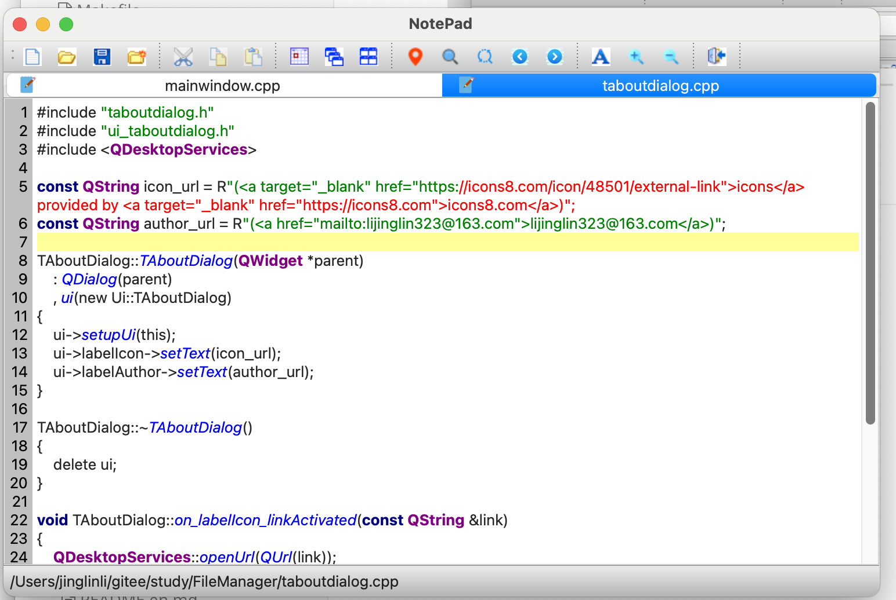

# qt-notepad

#### 介绍
notepad developped by qt 6.2

#### 软件架构
使用qt6.7 开发的文本编辑工具
跨平台，可以用于window/mac

#### 图形界面

#### 安装教程

1.  xxxx
2.  xxxx
3.  xxxx

#### 使用说明

1.  xxxx
2.  xxxx
3.  xxxx

#### 参与贡献

1.  Fork 本仓库
2.  新建 Feat_xxx 分支
3.  提交代码
4.  新建 Pull Request

#### 特技

